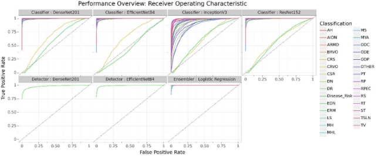

**MULTI-DISEASE DETECTION IN RETINAL IMAGING** 

**BASED ON ENSEMBLING HETEROGENEOUS DEEP LEARNING MODELS** 

*Dominik Müller1, Iñaki Soto-Rey1,2 and Frank Kramer1* 

1 IT-Infrastructure for Translational Medical Research, University of Augsburg, Germany 2 Medical Data Integration Center, University Hospital Augsburg, Germany 

Preprint - March 2021 

Page 1 / 8 

**ABSTRACT** 

Preventable or undiagnosed visual impairment and blindness affect billion of people worldwide. Automated multi-disease detection models offer great potential to address this problem via clinical decision support in diagnosis. In this work, we proposed an innovative multi-disease detection pipeline for retinal imaging which utilizes ensemble learning to combine the  predictive  capabilities  of  several  heterogeneous  deep convolutional neural network models. Our pipeline includes state-of-the-art  strategies  like  transfer  learning,  class weighting,  real-time  image  augmentation  and  Focal  loss utilization.  Furthermore,  we  integrated  ensemble  learning techniques like heterogeneous deep learning models, bagging via  5-fold  cross-validation  and  stacked  logistic  regression models. Through internal and external evaluation, we were able to validate and demonstrate high accuracy and reliability of our pipeline, as well as the comparability with other state- of-the-art pipelines for retinal disease prediction. 

***Index Terms—*** Retinal Disease Detection, Ensemble Learning, Class Imbalance, Multi-label Image Classification, Deep Learning*** 

1. **INTRODUCTION** 

Even if the medical progress in the last 30 years made it possible to successfully treat the majority of diseases causing visual impairment, growing and aging populations lead to an increasing  challenge  in  retinal  disease  diagnosis  [1].  The World Health Organization (WHO) estimates the prevalence of  blindness  and  visual  impairment  to  2.2  billion  people worldwide, of whom at least 1 billion affections could have been prevented or is yet to be addressed [2]. Early detection and correct diagnosis are essential to forestall disease course and prevent blindness.  

The use of clinical decision support (CDS) systems for diagnosis has been increasing over the past decade [3]. Recently, modern deep learning models allow automated and reliable  classification  of  medical  images  with  remarkable accuracy comparable to physicians [4]. Nevertheless, these models often lack capabilities to detect rare pathologies such as central retinal artery occlusion or anterior ischemic optic neuropathy [5], [6]. 

In  this  study  we  push  towards  creating  a  highly accurate and reliable multi-disease detection pipeline based on  ensemble,  transfer  and  deep  learning  techniques. Furthermore,  we  utilize  the  new  Retinal  Fundus  Multi- Disease Image Dataset (RFMiD) containing various rare and challenging  conditions  to  demonstrate  our  detection capabilities for uncommon diseases. 

2. **METHODS** 

The implemented medical image classification pipeline can be summarized in the following core steps and is illustrated in[ Fig. 1:](#_page1_x62.00_y299.00) 

- Stratified multi-label 5-fold cross-validation 
- Class weighted Focal loss and up-sampling 
- Extensive real-time image augmentation 
- Multiple deep learning model architectures 
- Ensemble learning strategies: bagging and stacking 
- Individual training for multi-disease labels and disease risk detection utilizing transfer learning on ImageNet 
- Stacked  binary  logistic  regression  models  for  distinct classification 
1. **Retinal Imaging Dataset** 

The RFMiD dataset consists of 3200 retinal images for which 1920 images were used as training dataset [7]. The fundus images  were  captured  by  three  different  fundus  cameras having a resolution of 4288x2848 (277 images), 2048x1536 (150 images) and 2144x1424 (1493 images), respectively. 

**Tab. 1.** Annotation frequency for each class in the dataset. 

**Disease  Samples** 

**Disease  Samples** DR  376 

**Disease  Samples **ARMD  100 

D. Risk  1519 MH  317 

DN  138 

MYA  101 

|BRVO |73 ||TSLN |186 ||ERM |14 |
| - | - | :- | - | - | :- | - | - |
|LS |47 ||MS |15 ||CSR |37 |
|ODC |282 ||CRVO |28 ||TV |6 |
|AH |16 ||ODP |65 ||ST |5 |
|AION |17 ||PT |11 ||RT |14 |
|RS |43 ||CRS |32 ||EDN |15 |
|RPEC |22 ||MHL |11 ||RP |6 |
|OTHER |34 |||||||
|||||||||

Preprint - March 2021 

Page 2 / 8 

**Fig. 1**. Flowchart diagram of the implemented medical image analysis pipeline for multi-disease detection in retinal imaging. The workflow is starting with the retinal imaging dataset (RFMiD) and ends with computed predictions for novel images. 

Preprint - March 2021 

Page  /  

The images were annotated with 46 conditions, including various rare and challenging diseases, through adjudicated consensus of two senior retinal experts. These 46 conditions are represented by the following classes, which are also listed in [ Tab.  1:](#_page0_x312.00_y569.00)  An  overall  normal/abnormal  class,  27  specific condition  classes  and  1  ‘OTHER’  class  consisting  of  the remaining  extremely  rare  conditions.  Besides  the  training dataset, the organizers of the RIADD challenge hold 1280 images back for external validation and testing datasets to ensure robust evaluation [7], [8]. 

2. **Preprocessing and Image Augmentation** 

In order to simplify the pattern finding process of the deep learning model, as well as to increase data variability, we applied several preprocessing methods. 

We utilized extensive image augmentation for up- sampling  to  balance  class  distribution  and  real-time augmentation  during  training  to  obtain  novel  and  unique images  in  each  epoch.  The  augmentation  techniques consisted  of  rotation,  flipping,  and  altering  in  brightness, saturation, contrast and hue. Through the up-sampling, it was ensured that each label occurred at least 100 times in the dataset which increased the total number of training images from 1920 to 3354. 

Afterwards, all images were square padded in order to avoid aspect ratio loss during posterior resizing. The retinal images were also cropped to ensure that the fundus is center located  in  the  image.  The  cropping  was  performed individually for each microscope resolution and resulted in the  following  image  shapes:  1424x1424,  1536x1536  and 3464x3464 pixels. The images were then resized to model 

input  sizes  according  to  the  neural  network  architecture, which  was  380x380  for  EfficientNetB4,  299x299  for InceptionV3 and 244x244 for all remaining architectures [9]– [12]. 

Before feeding the image to the deep convolutional neural network, we applied value intensity normalization as last preprocessing step. The intensities were zero-centered via the Z-Score normalization approach based on the mean and standard deviation computed on the ImageNet dataset [13]. 

3. **Deep Learning Models** 

The state-of-the-art for medical image classification are the unmatched deep convolutional neural network models [4], [14]. Nevertheless, the hyper parameter configuration and architecture selection are highly dependent on the required computer vision task, as well as the key difference between pipelines [4], [15]. Thus, our pipeline combines two different types  of  image  classification  models:  The  disease  risk detector for binary classifying normal/abnormal images and the  disease  label  classifier  for  multi-label  annotation  of abnormal images. 

Both model types were pretrained on the ImageNet dataset [13]. For the fitting process, we applied a transfer learning training, with frozen architecture layers except for the  classification  head,  and  a  fine-tuning  strategy  with unfrozen layers. Whereas the transfer learning fitting was performed for 10 epochs using the Adam optimization with an  initial  learning  rate  of  1-E04,  the  fine-tuning  had  a maximal training time of 290 epochs and using a dynamic learning rate for the Adam optimization starting from 1-E05 to a maximum decrease to 1-E07 (decreasing factor of 0.1 

after  8  epochs  without  improvement  on  the  monitored validation  loss)  [16].  Furthermore,  an  early  stopping  and model checkpoint technique was utilized for the fine-tuning process, stopping after 20 epochs without improvement (after epoch 60) and saving the best model measured according to the validation loss. Instead of defining an epoch as a cycle through the full training dataset, we establish an epoch to have 250 iterations. This allowed to increase the number of seen batches and, thus, to increase the information given to the model during the fitting process of an epoch. As training loss function, we utilized the weighted Focal loss from *Lin et al.* [17]. 

FL( ) = − (1 − ) log ( )  (1) 

In the above formula, *pt* is the probability for the correct ground truth class *t*, *γ* a tunable focusing parameter (which we set to 2.0) and *α* the associated weight for class *t*.

*t*

1. *Disease Risk Detector* 

The disease risk detector was established as a binary classifier of the disease risk class for general categorizing between normal and abnormal retinal images. Thus, this model type was trained using only the disease risk class and ignoring all multi-label annotations. Rather than using a single model architecture,  we  trained  multiple  models  based  on  the DenseNet201 and EfficientNetB4 architecture [9], [10]. For class weight computation, we divided the number of samples by the multiplication of the number of classes (2 for a binary classification) with the number of class occurrences in the dataset. 

2. *Disease Label Classifier* 

In contrast, the disease label classifier  was established as multi-label classifier of all 28 remaining classes (excluding disease risk) and was trained on the one hot encoded array of the disease labels. Furthermore, we utilized four different architectures for this model type: ResNet152, InceptionV3, DenseNet201 and EfficientNetB4 [9]–[12]. Identical to class weight computation of the disease risk detector, we computed the  weights  individually  as  binary  classification  for  each class. Even if this classifier is provided with all classes, the binary  weights  balance  the  decision  for  each  label individually. 

4. **Ensemble Learning Strategy** 
1. *Bagging* 

Next  to  the  utilization  of  multiple  architecture,  we  also applied a 5-fold cross-validation based as a bagging approach for ensemble learning. Our aim was to create a large variety of models which were trained on different subsets of the training data. This approach not only allowed a more efficient usage of the available training data, but also increased the 

reliability  of  a  prediction.  This  strategy  resulted  in  an ensemble of 10 disease risk detector models (2 architectures with each 5 folds) and 20 disease label classifier models (4 architectures with each 5 folds). 

2. *Stacking* 

For combining the predictions of our, in total, 30 models, we integrated a stacking setup. On top of all deep convolutional neural  networks,  we  applied  a  binary  logistic  regression algorithm for each class, individually. Thus, the predictions of  all  models  were  utilized  as  input  for  computing  the classification  of  a  single  class.  This  approach  allowed combining the information of all other class predictions to derive an inference for one single class. Overall, this strategy resulted  in  29  distinct  logistic  regression  models  (1  for disease  risk  and  28  for  each  disease-label  including  the ‘other’ class). The individual predicted class probabilities are then concatenated to the final prediction.  

The  logistic  regression  models  were  also  trained with the same 5-fold cross-validation sampling on a heavily augmented version of the training dataset to avoid overfitting as well as avoiding training the logistic regression models on already seen images from the neural network models. As logistic regression solver, we utilized the large-scale bound- constrained optimization (short: ‘LBFGS’) from *Zhu et al*. [18]. 

3. **RESULTS AND DISCUSSION** 

The sequential training of a complete cross-validation for one architecture on a single NVIDIA TITAN RTX GPU took around 13.5 hours with 63 epochs on average for each deep convolutional  neural  network  model.  Logistic  Regression training required less than 30 minutes for all class models combined.  No  signs  of  overfitting  were  observed  for  the disease label classifiers through validation monitoring, as it can be seen in[ Fig. 2.](#_page2_x314.00_y660.00) However, the disease risk detectors showed a strong trend to overfit after the transfer learning phase. Through our strategy to use the model with the best 

**Fig. 2.** Loss course during the training process for training and validation data. The lines were computed via locally estimated scatterplot smoothing and represent the average loss  across  all  folds.  The  gray  areas  around  the  lines represent the confidence intervals. 

Preprint - March 2021 

Page 4 / 8 

**Fig. 3.** Receiver operating characteristic (ROC) curves for each model type applied in our pipeline. The ROC curves showing the individual model performance measured by the true positive and false positive rate. The cross-validation models were macro-averaged for each model type to reduce illustration complexity. 

validation  loss,  it  was  still  possible  to  obtain  a  powerful  including the ‘OTHER’ class consisting of various extremely model for detection.   rare  conditions.  Nevertheless,  the  two  classes  ‘EDN’  and ‘CRS’ were the most challenging conditions for all classifier 

**3.1. Internal Performance Evaluation**  models.  Both  classes  belong  to  very  rare  conditions, combined with less than 1.2% occurrence in the original and For estimating the performance of our pipeline, we utilized  2.5% occurrence in the up-sampled dataset. Still, our stacked the validation subsets of the 5-fold cross-validation models  logistic regression algorithm was able to balance this issue from  the  heavily  augmented  version  of  our  dataset.  This  and infer the correct ‘EDN’ and ‘CRS’ classifications through approach allowed to obtain testing samples which were never  context.  Overall,  our  applied  ensemble  learning  strategies seen  in  the  training  process  for  reliable  performance  resulted in a significant performance improvement compared evaluation.  For  the  complex  multi-label  evaluation,  we  to the individual deep convolutional neural network models. computed  the  popular  area  under  the  receiver  operating  More details on the internal performance evaluation are listed characteristic (AUROC) curve, as well as the mean average  in[ Tab. 2.](#_page3_x312.00_y556.00) 

precision  (mAP).  Both  scores  were  macro-averaged  over 

classes and cross-validation folds to reduce complexity.  **3.2. External Evaluation through the RIADD Challenge** 

Our  multi-disease  detection  pipeline  revealed  a 

strong  and  robust  classification  performance  with  the  Furthermore, we participated at the RIADD challenge which capability to also detect rare conditions accurately in retinal  was organized by the authors of the RFMiD dataset [7], [8]. images.  Whereas  the  disease  label  classifier  models  The challenge participation allowed not only an independent separately only achieved an AUROC of around 0.97 and a 

mAP of 0.93, the disease risk detectors demonstrated to have  **Tab.  2**.  Achieved  results  of  the  internal  performance a really strong predictive power of 0.98 up to 0.99 AUROC  evaluation showing the average AUROC and mAP score for and  mAP.  However,  for  the  classifiers  the  InceptionV3  each model utilized in our pipeline. The scores were macro- architecture  indicated  to  have  the  worst  performance  averaged across all cross-validation folds and classes. 

compared to the other architectures with only 0.93 AUROC  **AUROC  mAP** 

**Model Type Classifier Classifier Classifier Classifier Detector Detector** 

**Architecture** DenseNet201 EfficientNetB4 ResNet151 InceptionV3 DenseNet201 EfficientNetB4 

and  0.66  mAP.  The  associated  receiver  operating 

characteristics of the models are illustrated in[ Fig. 3.](#_page3_x51.00_y273.00)  0.973 

0.931 0.929 0.930 0.663 0.997 0.999 

Training a strong multi-label classifier is in general  0.969 

a  complex  task,  however,  the  extreme  class  imbalance  0.970 

between the conditions revealed a hard challenge for building  0.932 

a reliable model [19], [20]. Our applied up-sampling and 

class  weighting  technique demonstrated  to  have  a  critical  0.980 

0.993 

boost on the predictive capabilities of the classifier models. Nearly  all  labels  were  able  to  be  accurately  detected, 

|**Ensembler** ||Logistic Regression |0.99|0.999 |
| - | :- | - | - | - |
||||||

Preprint - March 2021  Page 6 / 8 

evaluation  of  the  predictive  power  of  our  pipeline  on  an unseen and unpublished testing set, but also the comparison with the currently best retinal disease classifiers in the world.  

In our participation, we were able to reach rank 19 from a total of 59 teams in the first evaluation phase and rank 8 in the final phase. In the independent evaluation from the challenge organizers, we achieved an AUROC of 0.95 for the disease  risk  classification.  For  multi-label  scoring,  they computed the average between the macro-averaged AUROC and the mAP, for which we reached the score 0.70. The top performing ranks shared only a marginal scoring difference which is why we had only a final score difference of 0.05 to the first ranked team. Furthermore, the participation results demonstrated that ensemble learning based classification for deep convolutional neural network models is compatible or even superior to other approaches in the scientific field such as focusing on a single large architecture. 

**3.3. Experiments and Improvements** 

Additionally, we experimented with using weighted cross- entropy loss for training our both model types. This resulted in inferior models for disease label classification, however, the  cross-entropy  loss  fitted  disease  risk  detector  models showed  less  overfitting  with  equal  performance.  Further experimentation  with  loss  functions  for  the  disease  risk detector  models  could  provide  the  solution  to  avoid overfitting. 

An  important  point  for  the  RIADD  challenge participation would be the utilization of more training data, especially  for  the  difficult  ‘CRS’  and  ‘EDN’  classes. According  to  the  challenge  rules,  other  public  available datasets like Kaggle DR, IDRiD, Messidor or APTOS are allowed  to  be  used  as  additional  training  data  [8].  Our pipeline,  which  was  trained  exclusively  on  the  RFMiD dataset, could be further improved with more retinal images of  very  rare  conditions.  Besides  the  training  data,  more improvement points for further research  in retinal disease detection would be the inclusion of image cropping strategies to reduce information loss through resolution resizing, the usage of more architectures (especially with different input resolutions)  to  increase  the  model  ensemble,  and  the utilization  of  specific  retinal  filters  or  retinal  vessel segmentation  as  additional  information  to  utilize  for  the predictions.  

4. **CONCLUSIONS** 

In  this  study,  we  introduced  a  powerful  multi-disease detection  pipeline  for  retinal  imaging  which  exploits ensemble learning techniques to combine the predictions of various deep convolutional neural network models. Next to state-of-the-art  strategies,  such  as  transfer  learning,  class weighting, extensive real-time image augmentation and Focal loss utilization, we applied 5-fold cross-validation as bagging technique and used multiple convolutional neural network 

architectures  to  create  an  ensemble  of  models.  With  a stacking approach of class-wise distinct logistic regression models, we combined the knowledge of all neural network models  to  compute  highly  accurate  and  reliable  retinal condition  predictions.  Next  to  an  internal  performance evaluation, we also proved the precision and comparability of our  pipeline  through  the  participation  at  the  RIADD challenge.  

**APENDIX** 

In order to ensure full reproducibility and to create a base for further research, the complete code of this study, including extensive documentation, is available in the following public Git repository:  https://github.com/frankkramer-lab/riadd.aucmedi Furthermore,  the  trained  models,  evaluation  results  and metadata  are  available  in  the  following  public  Zenodo repository: 

https://doi.org/10.5281/zenodo.4573990 

**ACKNOWLEDGMENTS** 

We  want  to  thank  Dennis  Klonnek,  Edmund  Müller  and Johann Frei for their useful comments and support. 

**COMPLIANCE WITH ETHICAL STANDARDS**  

This  research  study  was  conducted  retrospectively  using human  subject  data  made  available  in  open  access  by *Pachade et al.* [7], [8]. Ethical approval was not required as confirmed by the license attached with the open access data. 

**CONFLICT OF INTEREST** None declared. 

**FUNDING** 

This work is a part of the DIFUTURE project funded by the German  Ministry  of  Education  and  Research (Bundesministerium  für  Bildung  und  Forschung,  BMBF) grant FKZ01ZZ1804E. 

**REFERENCES** 

1. J. D. Adelson *et al.*, “Causes of blindness and vision impairment in 2020 and trends over 30 years, and prevalence of avoidable blindness in  relation  to  VISION  2020:  the  Right  to  Sight:  an analysis for the Global Burden of Disease Study,” *Lancet Glob. Heal.*,  vol.  9,  no.  2,  pp.  e144–e160,  Feb.  2021,  doi: 10.1016/S2214-109X(20)30489-7. 
1. World Health Organization, “Blindness and vision impairment.” https://www.who.int/news-room/fact-sheets/detail/blindness-and- visual-impairment (accessed Feb. 27, 2021). 
1. R. T. Sutton, D. Pincock, D. C. Baumgart, D. C. Sadowski, R. N. Fedorak, and K. I. Kroeker, “An overview of clinical decision support systems: benefits, risks, and strategies for success,” *npj Digital Medicine*, vol. 3, no. 1. Nature Research, pp. 1–10, Dec. 

Preprint - March 2021  Page 7 / 8 

01, 2020, doi: 10.1038/s41746-020-0221-y. 

4. G. Litjens *et al.*, “A survey on deep learning in medical image analysis,” *Med. Image Anal.*, vol. 42, no. December 2012, pp. 60– 88, 2017, doi: 10.1016/j.media.2017.07.005. 
4. J. Y. Choi, T. K. Yoo, J. G. Seo, J. Kwak, T. T. Um, and T. H. Rim, “Multi-categorical deep learning neural network to classify retinal images: A pilot study employing small database,” *PLoS One*,  vol.  12,  no.  11,  p.  e0187336,  Nov.  2017,  doi: 10.1371/journal.pone.0187336. 
4. G. Quellec, M. Lamard, P. H. Conze, P. Massin, and B. Cochener, “Automatic detection of rare pathologies in fundus photographs using few-shot learning,” *Med. Image Anal.*, vol. 61, p. 101660, Apr. 2020, doi: 10.1016/j.media.2020.101660. 
4. S. Pachade *et al.*, “Retinal Fundus Multi-Disease Image Dataset (RFMiD): A Dataset for Multi-Disease Detection Research,” *Data*, vol. 6, no. 2, p. 14, Feb. 2021, doi: 10.3390/data6020014. 
4. “Home  -  RIADD  (ISBI-2021)  -  Grand  Challenge.” https://riadd.grand-challenge.org/Home/ (accessed Feb. 27, 2021). 
4. G. Huang, Z. Liu, L. van der Maaten, and K. Q. Weinberger, “Densely Connected Convolutional Networks,” *Proc. - 30th IEEE Conf. Comput. Vis. Pattern Recognition, CVPR 2017*, vol. 2017- January, pp. 2261–2269, Aug. 2016, Accessed: Feb. 27, 2021. [Online]. Available: http://arxiv.org/abs/1608.06993. 
4. M. Tan and Q. V. Le, “EfficientNet: Rethinking Model Scaling for Convolutional Neural Networks,” *36th Int. Conf. Mach. Learn. ICML  2019*,  vol.  2019-June,  pp.  10691–10700,  May  2019, Accessed:  Feb.  27,  2021.  [Online].  Available: http://arxiv.org/abs/1905.11946. 
4. C. Szegedy, V. Vanhoucke, S. Ioffe, J. Shlens, and Z. Wojna, “Rethinking the Inception Architecture for Computer Vision,” in *Proceedings  of  the  IEEE  Computer  Society  Conference  on Computer Vision and Pattern Recognition*, Dec. 2016, vol. 2016- December, pp. 2818–2826, doi: 10.1109/CVPR.2016.308. 
4. K. He, X. Zhang, S. Ren, and J. Sun, “Deep residual learning for image recognition,” in *Proceedings of the IEEE Computer Society Conference on Computer Vision and Pattern Recognition*, Dec. 2016,  vol.  2016-December,  pp.  770–778,  doi: 10.1109/CVPR.2016.90. 
4. O. Russakovsky *et al.*, “ImageNet Large Scale Visual Recognition Challenge,” *Int. J. Comput. Vis.*, vol. 115, no. 3, pp. 211–252, Dec. 2015, doi: 10.1007/s11263-015-0816-y. 
4. S.  Muhammad  *et  al.*,  “Medical  Image  Analysis  using Convolutional Neural Networks A Review,” *J. Med. Syst.*, vol. 42, no. 11, pp. 1–13, Nov. 2018, doi: 10.1007/s10916-018-1088-1. 
4. J. Ker, L. Wang, J. Rao, and T. Lim, “Deep Learning Applications in Medical Image Analysis,” *IEEE Access*, vol. 6, pp. 9375–9379, 2017, doi: 10.1109/ACCESS.2017.2788044. 
4. D. P. Kingma and J. Lei Ba, “Adam: A Method for Stochastic Optimization,” 2014. https://arxiv.org/abs/1412.6980. 
4. T.-Y. Lin, P. Goyal, R. Girshick, K. He, and P. Dollár, “Focal Loss for Dense Object Detection,” *IEEE Trans. Pattern Anal. Mach. Intell.*, vol. 42, no. 2, pp. 318–327, Aug. 2017, Accessed: Feb. 27, 2021. [Online]. Available: http://arxiv.org/abs/1708.02002. 
4. C. Zhu, R. H. Byrd, P. Lu, and J. Nocedal, “L-BFGS-B: Fortran Subroutines  for Large-Scale  Bound-Constrained  Optimization,” *ACM Trans. Math. Softw.*, vol. 23, no. 4, pp. 550–560, Dec. 1997, doi: 10.1145/279232.279236. 
4. P. Kaur and A. Gosain, “Issues and challenges of class imbalance problem in classification,” *Int. J. Inf. Technol.*, pp. 1–7, Oct. 2020, doi: 10.1007/s41870-018-0251-8. 
4. L.  Gao,  L.  Zhang,  C.  Liu,  and  S.  Wu,  “Handling  imbalanced 

medical  image  data:  A  deep-learning-based  one-class classification approach,” *Artif. Intell. Med.*, vol. 108, p. 101935, Aug. 2020, doi: 10.1016/j.artmed.2020.101935. 
Preprint - March 2021  Page 8 / 8 
